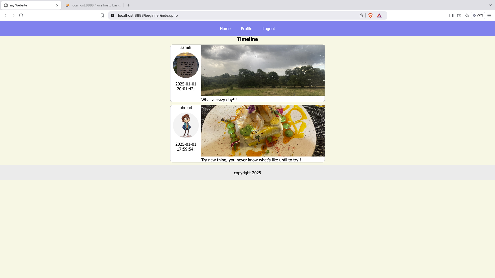

# Social Media Web Application

A simple social media platform built with PHP and MySQL that allows users to create profiles, share posts with images, and interact with other users' content.

## Features

### User Management

- User registration with username, email, and password
- Secure login/logout functionality
- Profile management (edit/delete)
- Profile picture upload support
- Session-based authentication

### Posts

- Create text posts with optional image attachments
- View posts from all users in a timeline
- Edit and delete your own posts
- Image upload support for posts (JPEG format)
- Chronological post display with user information

### Database Schema

#### Users Table

- id (Primary Key)
- username
- email
- password
- image (profile picture path)
- date (registration date)

#### Posts Table

- id (Primary Key)
- user_id (Foreign Key)
- post (content)
- image (optional image path)
- date (creation timestamp)

